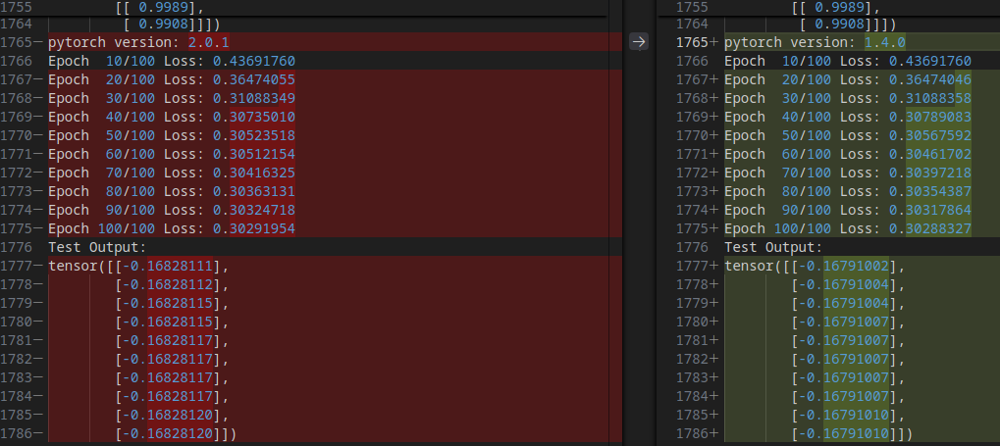

# Testing different versions of PyTorch

The purpose of this project is to show / demonstrate the different numerical results that arise when changing versions of PyTorch.

For this matter, we use three different Docker images provide by [anibali](https://github.com/anibali/docker-pytorch.git):

        docker pull anibali/pytorch:2.0.1-nocuda

        docker pull anibali/pytorch:1.4.0-nocuda

        docker pull anibali/pytorch:1.13.1-nocuda

We start containers from these images and run the Python script **pytorch-test.py** inside the containers. Then we compare the results.

First try:

        docker run --name pytorch-1.13.1 --rm -i -t -v ./pytorch-test.py:/app/pytorch-test.py anibali/pytorch:1.13.1-nocuda python3 /app/pytorch-test.py &> pytorch-1.13.1.log

        docker run --name pytorch-2.0.1 --rm -i -t -v ./pytorch-test.py:/app/pytorch-test.py anibali/pytorch:2.0.1-nocuda python3 /app/pytorch-test.py &> pytorch-2.0.1.log

The bash script **run-tests.sh** runs the Python script and generates a log file for each run. To see what's this project is all about compare the results at the end of theses log files:

